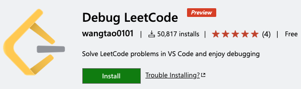

# how to debug LeetCode in VScode

install two Visual Studio Code Snippets

- LeetCode

- Debug LeetCode

open the LeetCode in vscode sidebar
> you need to sign in, and you can see the LeetCode problems

debug the code when you click "code run"

Have a enjoyment!
