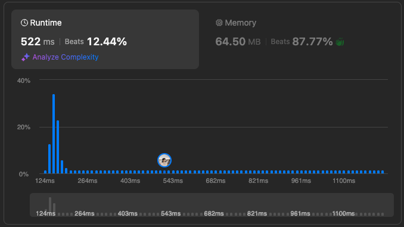
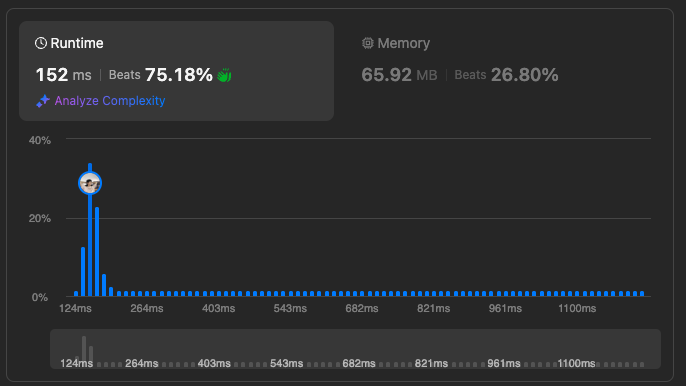

# 3Sum

Given an integer array nums, return all the triplets `[nums[i], nums[j], nums[k]]` such that `i != j`, `i != k`, and `j != k`, and `nums[i] + nums[j] + nums[k] == 0`.

Notice that the solution set must not contain duplicate triplets.

**Example 1:**
> Input: nums = [-1,0,1,2,-1,-4]
Output: [[-1,-1,2],[-1,0,1]]
Explanation:
nums[0] + nums[1] + nums[2] = (-1) + 0 + 1 = 0.
nums[1] + nums[2] + nums[4] = 0 + 1 + (-1) = 0.
nums[0] + nums[3] + nums[4] = (-1) + 2 + (-1) = 0.
The distinct triplets are [-1,0,1] and [-1,-1,2].
Notice that the order of the output and the order of the triplets does not matter.

**Example 2:**
> Input: nums = [0,1,1]
Output: []
Explanation: The only possible triplet does not sum up to 0.

**Example 3:**
> Input: nums = [0,0,0]
Output: [[0,0,0]]
Explanation: The only possible triplet sums up to 0.

**Constraints:**

- 3 <= nums.length <= 3000
- -105 <= nums[i] <= 105

----

this is my solution, it's not the best solution, but it works.

let me tell you how i think about it.


```javascript
/**
 * @param {number[]} nums
 * @return {number[][]}
 */
var threeSum = function(nums) {
   // using Set Collection to remove duplicates
   const resultArr = new Set()
    // the reason we need to sort it that go to next based on whether it is below zero or above zero
    nums.sort((a, b) => a - b)
    for (let i = 0, len = nums.length; i < len; i++) {
      // skip the loop if it is the same as the previous one
      if(i>0 && nums[i] === nums[i - 1]) continue
      // optimize the loop
      if (nums[i] > 0) break
      // we get this information to find the complement from the problem, x+y = 0 - nums[i]
      const complement1 = 0 - nums[i]
      const map = new Map()
      for (let j = i + 1; j < len; j++) {
        // x = complement1 - y
        const complement2 = complement1 - nums[j]
        if (map.has(complement2)) {
          // stop duplicates and convenient for recovery into array 
          const resultStr = `${nums[i]},${complement2},${nums[j]}`
          resultArr.add(resultStr)
        }
        map.set(nums[j], j)
      }
    }
    // restore from the set collection to the expected array
    const result =  Array.from(resultArr).map(r => r.split(',').map(numStr =>parseInt(numStr)))
    return result
};
```



// improve solution

```javascript
var threeSum = function(nums) {
  if(nums.length === 0) return []
  
  nums.sort((a,b) => a-b)
  let result = []
  for(let i=0, len=nums.length-2;i<len;i++) {
    // stop duplicates form occurring
    if(i>0&&nums[i]===nums[i-1]) continue
    if(nums[i]>0) break
    let j = i+1
    let k = nums.length-1
    while(j<k) {
      let sum = nums[i]+nums[j]+nums[k]
      if(sum === 0) {
        result.push([nums[i],nums[j],nums[k]])
        // stop duplicates
        while(nums[j]===nums[j+1]) j++
        while(nums[k]===nums[k-1]) k--
        j++
        k--
      } else if(sum<0) {
        j++
      } else if(sum>0) {
        k--
      }
    }
  }
  return result
}
```



[Official Problem Link](https://leetcode.com/problems/3sum/description/)

[Video Explanation](https://www.youtube.com/watch?v=2sgT3XXdWEQ)
