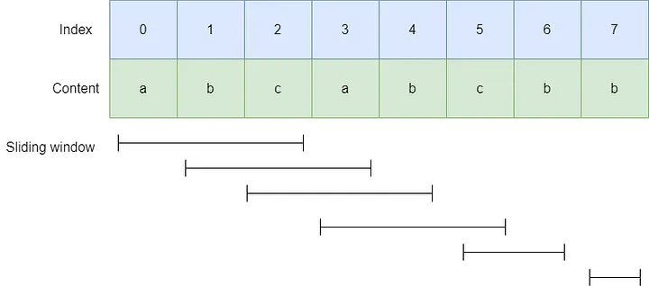

# Longest Substring Without Repeating Characters

Given a string `s`, find the length of the longest
`substring` without repeating characters.

**Example 1:**
> Input: s = "abcabcbb" </br>
> Output: 3 </br>
> Explanation: The answer is "abc", with the length of 3.

**Example 2:**
> Input: s = "bbbbb" </br>
> Output: 1 </br>
> Explanation: The answer is "b", with the length of 1.

**Example 3:**
> Input: s = "pwwkew" </br>
> Output: 3 </br>
> Explanation: The answer is "wke", with the length of 3. </br>
> Notice that the answer must be a substring, "pwke" is a subsequence and not a substring.

**Constraints:**

- `0 <= s.length <= 5 * 104`
- `s` consists of English letters, digits, symbols and spaces.

```javascript
/**
 * point:
 * by traversing the entire string,
 * obtain the corresponding string group,
 * and then compare it.
 */
/**
 * @param {string} s
 * @return {number}
 */
var lengthOfLongestSubstring = function(s) {
    // 1.initialize two empty array to store the result and the current substring.
    let resultArr = []
    let temArr =[]
    // 2.iterate through the entire string.
   for(let i = 0, len =s.length; i < len; i++) {
    const item = s[i]
    const index = temArr.indexOf(item)
    if(index !== -1) {
      // appear repeating character
      // 3.assign the longest length to resultArr
      resultArr = temArr.length > resultArr.length ? temArr : resultArr
      // 4.intercept the previous different string as the current value
      temArr = temArr.length > 1? [...temArr.slice(index+1),item] : [item]
    } else {
      // not appear repeating character
     temArr.push(item)
    }
   }
   // 5.insure measure: compare the length of the current substring and the result's length
   return Math.max(temArr.length, resultArr.length)
};
```




sliding window + set collection

```javascript
/**
 * @param {string} s
 * @return {number}
 */
var lengthOfLongestSubstring = function(s) {
   // a set used to store the characters in the current substring, allowing for fast checks to see if a character has appeared before.
    const set = new Set();
    // initialize the variables maxLen, currentLen, and deleteIndex to 0, and start with an empty set
    let maxLen = 0, currentLen = 0, deleteIndex = 0;
    // loop each element in the string
    for (let i = 0; i < s.length; i++) {
      // if the current character is already in the set (indicating a duplicate), update maxLen to be the maximum of currentLen and maxLen. Then, shrink the current substring by removing characters from the set starting from deleteIndex until the current character is no longer in the set. This ensures that the newly constructed substring will not have duplicates, reducing currentLen accordingly.
        if (set.has(s[i])) {
            maxLen = Math.max(maxLen, currentLen);
            while (set.has(s[i])) {
                currentLen--;
                set.delete(s[deleteIndex++]);
            }
        }
        // add the current character to the set and increment currentLen.
        set.add(s[i]);
        currentLen++;
    }
    // at the end of the traversal, return the maximum of maxLen and currentLen as the result, representing the length of the longest substring without repeating characters. The check for currentLen at the end is unnecessary because updates are already made during the loop.
    return Math.max(maxLen, currentLen);
};
```

[Official Problem Link](https://leetcode.com/problems/longest-substring-without-repeating-characters/description/)

[Video Explanation](https://www.youtube.com/watch?v=i1edO6FkGm0)
