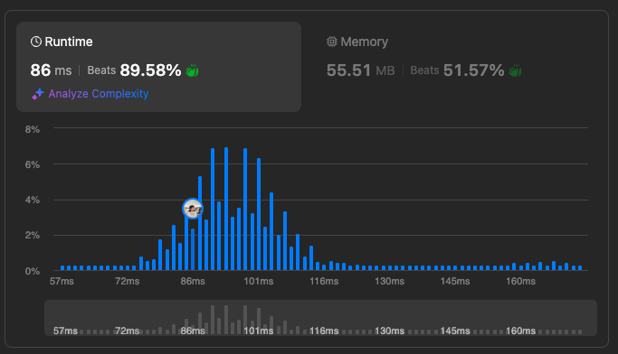
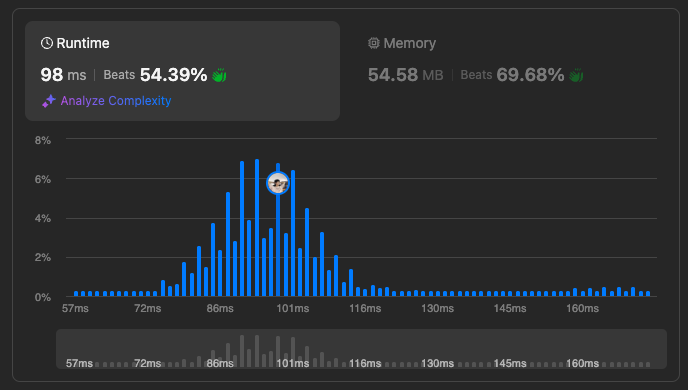

# Median Of Two Sorted Arrays

Given two sorted arrays nums1 and nums2 of size m and n respectively, return the median of the two sorted arrays.

The overall run time complexity should be O(log (m+n)).

**Example 1:**

> Input: nums1 = [1,3], nums2 = [2] </br>
> Output: 2.00000  </br>
> Explanation: merged array = [1,2,3] and median is 2.

**Example 2:**

> Input: nums1 = [1,2], nums2 = [3,4]  </br>
> Output: 2.50000  </br>
> Explanation: merged array = [1,2,3,4] and median is (2 + 3) / 2 = 2.5.

**Constraints:**

- nums1.length == m
- nums2.length == n
- 0 <= m <= 1000
- 0 <= n <= 1000
- 1 <= m + n <= 2000
- -106 <= nums1[i], nums2[i] <= 106

```javascript
/**
 * @param {number[]} nums1
 * @param {number[]} nums2
 * @return {number}
 */
var findMedianSortedArrays = function(nums1, nums2) {
 const merryArr = nums1.concat(nums2)
  merryArr.sort((a, b) => a - b)
  const middleLeft = Math.floor(merryArr.length/2)
  // odd or even
  if(merryArr.length % 2){
    return merryArr[middleLeft]
  } else {
    return (merryArr[middleLeft] + merryArr[middleLeft - 1]) / 2
  }
};
```



```javascript
/**
 * @param {number[]} nums1
 * @param {number[]} nums2
 * @return {number}
 */
var findMedianSortedArrays = function(nums1, nums2) {
    let merged = [];
    let i = 0, j = 0;

    while (i < nums1.length && j < nums2.length) {
        if (nums1[i] < nums2[j]) {
            merged.push(nums1[i++]);
        } else {
            merged.push(nums2[j++]);
        }
    }

    while (i < nums1.length) merged.push(nums1[i++]);
    while (j < nums2.length) merged.push(nums2[j++]);

    let mid = Math.floor(merged.length / 2);
    if (merged.length % 2 === 0) {
        return (merged[mid-1] + merged[mid]) / 2;
    } else {
        return merged[mid];
    }
};
```



[Official Problem Link](https://leetcode.com/problems/median-of-two-sorted-arrays/)

[Video Explanation](https://www.youtube.com/watch?v=2sgT3XXdWEQ)
